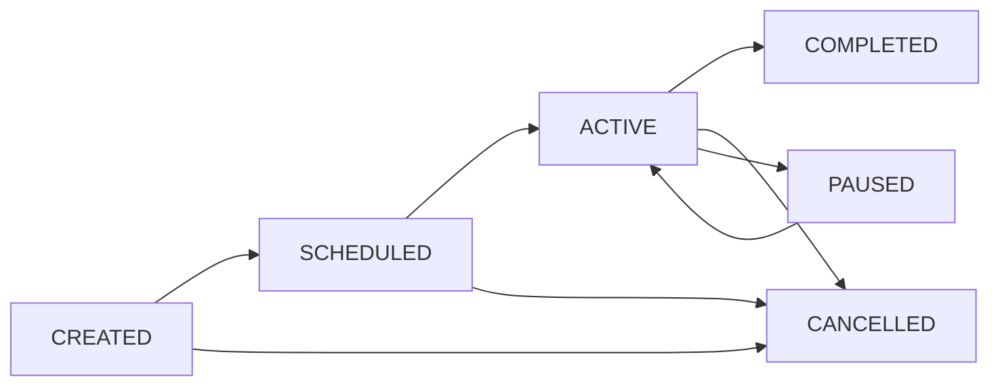

# 🎯 SwiftEvents

<div align="center">


**A comprehensive, feature-rich event management system for Minecraft servers**

*Create, manage, and automate server events with beautiful GUIs, interactive chat, and powerful API integration*

</div>

---

## 🌟 **About**

SwiftEvents is the ultimate event management solution for PaperMC servers, offering a complete ecosystem for creating engaging player experiences.

### ✨ **Key Highlights**
- 🎮 **Event Types**: PvP, PvE, Building, Racing, Treasure Hunt, Mini-Games, and Custom
- 🤖 **Automated Events**: Smart event tasker with weighted random selection
- 💬 **Interactive Chat**: Click-to-join announcements with teleportation
- 📊 **Dual Storage**: MySQL database or JSON files with automatic fallback
- 🎨 **GUI**: Beautiful interfaces for both players and administrators
- 🔧 **SwiftEvents API**: Comprehensive integration system for developers
- 🌐 **Language Support**: Configurable localization

---

## 🚀 **Features**

<details>
<summary><b>📊 Storage & Database</b></summary>

- **MySQL Integration** with connection pooling and transaction support
- **JSON File System** as lightweight alternative
- **Automatic Backup System** with configurable intervals
- **Data Migration Tools** for switching between storage types
- **Performance Optimization** with caching and batch operations

</details>

<details>
<summary><b>🎮 Event Management</b></summary>

- **Multi-Type Events**: PvP tournaments, building contests, treasure hunts, and more
- **Smart Scheduling**: Automatic event creation with customizable intervals
- **Participant Management**: Configurable limits, permissions, and cooldowns
- **Event Lifecycle**: Complete status tracking from creation to completion
- **Location System**: Set specific locations for events with teleportation
- **Reward Integration**: Built-in reward system with command execution

</details>

<details>
<summary><b>🖥️ User Interface</b></summary>

- **Player GUI**: Intuitive event browser with filtering and sorting
- **Admin Panel**: Comprehensive management interface
- **HUD Notifications**: Action bar, boss bar, or title displays
- **Interactive Chat**: Clickable announcements with hover tooltips
- **Real-time Updates**: Live event information with auto-refresh

</details>

<details>
<summary><b>🤖 Automation</b></summary>

- **Event Tasker**: Automated event scheduling with intelligent selection
- **Preset Templates**: Pre-configured event types with customizable parameters
- **Weight-based Selection**: Control event frequency with weighted random selection
- **Smart Announcements**: Automatic reminders and notifications
- **Conditional Logic**: Event creation based on player count and server conditions

</details>

<details>
<summary><b>🔧 Developer API</b></summary>

- **Static API**: Easy-to-use methods for common operations
- **Custom Events**: Bukkit events for deep integration
- **Hook System**: Advanced integration interface for complex modifications
- **Event Lifecycle**: Complete control over event creation and management
- **Player Management**: Join/leave operations with validation

</details>

---

## ⚡ **Quick Start**

### 📥 Installation

1. **Download** the latest `SwiftEvents.jar` from the releases page
2. **Place** the file in your server's `plugins/` directory
3. **Start** your server (plugin will generate default configuration)
4. **Configure** settings in `plugins/SwiftEvents/config.yml`
5. **Restart** or reload your server

### 🎯 First Event

```bash
# Create your first event (as an admin)
/eventadmin create "PvP Tournament" PVP "Epic battle royale!"

# Players can then join
/event join "PvP Tournament"

# Or use the GUI
/eventgui
```

---

## 📋 **Commands**

### 👤 **Player Commands**

| Command | Description | Permission |
|---------|-------------|------------|
| `/event list` | View all available events | `swiftevents.user.list` |
| `/event info <name>` | Get detailed event information | `swiftevents.user.info` |
| `/event join <name>` | Join an event | `swiftevents.user.join` |
| `/event leave <name>` | Leave an event | `swiftevents.user.leave` |
| `/event teleport <id>` | Teleport to event location | `swiftevents.user.teleport` |
| `/eventgui` | Open events GUI | `swiftevents.user.gui` |

### 👑 **Admin Commands**

| Command | Description | Permission |
|---------|-------------|------------|
| `/eventadmin` | Open admin GUI | `swiftevents.admin.gui` |
| `/eventadmin create <name> <type> <desc>` | Create new event | `swiftevents.admin.create` |
| `/eventadmin delete <name>` | Delete an event | `swiftevents.admin.delete` |
| `/eventadmin start <name>` | Start an event | `swiftevents.admin.start` |
| `/eventadmin stop <name>` | Stop an event | `swiftevents.admin.stop` |
| `/eventadmin list` | List all events with details | `swiftevents.admin` |
| `/eventadmin reload` | Reload configuration | `swiftevents.admin.reload` |
| `/eventadmin tasker <action>` | Manage event tasker | `swiftevents.admin.tasker` |

**Tasker Actions**: `start`, `stop`, `status`, `force`, `presets`

---

## 🔑 **Permissions**

<details>
<summary><b>Permission Structure</b></summary>

```yaml
# Root permissions
swiftevents.*                    # All SwiftEvents permissions
swiftevents.admin.*              # All admin permissions  
swiftevents.user.*               # All user permissions
swiftevents.event.*              # All event type permissions
swiftevents.bypass.*             # All bypass permissions

# User permissions (default: true)
swiftevents.user                 # Basic user access
swiftevents.user.join            # Join events
swiftevents.user.leave           # Leave events
swiftevents.user.list            # List events
swiftevents.user.info            # View event info
swiftevents.user.gui             # Use event GUI
swiftevents.user.teleport        # Teleport to events

# Admin permissions (default: op)
swiftevents.admin                # Basic admin access
swiftevents.admin.create         # Create events
swiftevents.admin.delete         # Delete events
swiftevents.admin.manage         # Manage events
swiftevents.admin.tasker         # Control event tasker
swiftevents.admin.reload         # Reload configuration

# Event type permissions
swiftevents.event.pvp            # Join PvP events
swiftevents.event.pve            # Join PvE events
swiftevents.event.building       # Join building events
swiftevents.event.racing         # Join racing events
swiftevents.event.treasure       # Join treasure hunts
swiftevents.event.minigame       # Join mini-games
swiftevents.event.custom         # Join custom events

# Bypass permissions (default: op)
swiftevents.bypass.cooldown      # Bypass join cooldowns
swiftevents.bypass.limits        # Bypass participation limits
swiftevents.bypass.full          # Join full events
```

</details>

---

## ⚙️ **Configuration**

### 🔧 **Core Settings**

<details>
<summary><b>Database Configuration</b></summary>

```yaml
database:
  enabled: false              # Use MySQL (true) or JSON (false)
  type: mysql
  host: localhost
  port: 3306
  name: swiftevents
  username: root
  password: password
  connection_timeout: 30      # Connection timeout in seconds
  max_connections: 10         # Maximum connection pool size
```

</details>

<details>
<summary><b>Event System</b></summary>

```yaml
events:
  max_concurrent: 5           # Maximum simultaneous active events
  auto_save_interval: 300     # Auto-save frequency (seconds)
  player_cooldown: 300        # Cooldown between events (seconds)
  max_events_per_player: 3    # Max events per player
  track_statistics: true      # Enable statistics tracking
  auto_cancel_empty_after: 10 # Cancel empty events after X minutes
```

</details>

<details>
<summary><b>Automatic Event Tasker</b></summary>

```yaml
event_tasker:
  enabled: false              # Enable automatic event scheduling
  check_interval: 60          # Check frequency (seconds)
  min_event_interval: 30      # Minimum time between events (minutes)
  max_event_interval: 120     # Maximum time between events (minutes)
  announce_upcoming: true     # Announce upcoming events
  announce_time: 5            # Announcement timing (minutes before)
  
  presets:                    # Event templates
    pvp_tournament:
      name: "PvP Tournament #{number}"
      type: PVP
      duration: 1800          # 30 minutes
      max_participants: 20
      rewards:
        - "give {winner} diamond_sword 1"
      weight: 10              # Selection probability
```

</details>

<details>
<summary><b>GUI & HUD</b></summary>

```yaml
gui:
  enabled: true
  title: "§6SwiftEvents"
  size: 54                    # GUI size (multiple of 9)
  update_interval: 5          # Update frequency (seconds)
  animations_enabled: true    # Enable GUI animations

hud:
  enabled: true
  position: ACTION_BAR        # ACTION_BAR, BOSS_BAR, or TITLE
  notification_duration: 5    # Notification duration (seconds)
  colors:                     # Event type colors
    PVP: "#FF5555"
    BUILDING: "#55FF55"
    RACING: "#5555FF"
```

</details>

---

## 📝 **TODO / Planned Features**

### 🚨 **High Priority**
- [ ] **Complete GUI Implementation**
  - [ ] Player event browser GUI with filtering and sorting
  - [ ] Admin management panel with comprehensive controls
  - [ ] Event creation wizard with step-by-step setup
  - [ ] Real-time participant list with status indicators
  - [ ] Event statistics and analytics dashboard
  - [ ] Settings configuration GUI for admins

### 🎯 **Core Features**
- [ ] **Enhanced Event Types**
  - [ ] King of the Hill events
  - [ ] Team-based competitions
  - [ ] Elimination tournaments
  - [ ] Time-based challenges
  - [ ] Multi-stage events

- [ ] **Advanced Automation**
  - [ ] Conditional event triggers (time, weather, player count)
  - [ ] Event queue system for scheduled events
  - [ ] Dynamic difficulty scaling
  - [ ] Automatic event balancing

- [ ] **Reward System**
  - [ ] Multiple reward tiers (1st, 2nd, 3rd place)
  - [ ] Economy integration with Vault
  - [ ] Custom item rewards with NBT support
  - [ ] Experience and level rewards
  - [ ] Title and achievement system

### 🔧 **Technical Improvements**
- [ ] **Performance Optimization**
  - [ ] Async database operations
  - [ ] Event caching system
  - [ ] Memory usage optimization
  - [ ] Database query optimization

- [ ] **API Enhancements**
  - [ ] More comprehensive hook system
  - [ ] Event builder pattern API
  - [ ] Custom event type registration
  - [ ] Advanced event modification API

### 🌟 **Quality of Life**
- [ ] **Player Experience**
  - [ ] Event history and statistics for players
  - [ ] Personal event preferences
  - [ ] Event notifications and reminders
  - [ ] Spectator mode for events
  - [ ] Event replay system

- [ ] **Admin Tools**  
  - [ ] Event templates and presets manager
  - [ ] Bulk event operations
  - [ ] Advanced logging and debugging
  - [ ] Performance monitoring dashboard
  - [ ] Automated backup and restore

### 🔌 **Integrations**
- [ ] **Discord Integration**
  - [ ] Event announcements via webhooks
  - [ ] Cross-platform event management
  - [ ] Discord bot commands

- [ ] **Plugin Compatibility**
  - [ ] PlaceholderAPI placeholders
  - [ ] WorldGuard region integration
  - [ ] MythicMobs integration for PvE events
  - [ ] Citizens NPC integration

### 🌐 **Advanced Features**
- [ ] **Multi-Server Support**
  - [ ] Cross-server events via BungeeCord/Velocity
  - [ ] Shared event database
  - [ ] Network-wide leaderboards

- [ ] **Customization**
  - [ ] Custom sound effects and particles
  - [ ] Configurable GUI layouts and themes
  - [ ] Custom message formatting with MiniMessage
  - [ ] Skin/texture pack integration for event items

### 🐛 **Bug Fixes & Polish**
- [ ] **Stability**
  - [ ] Edge case handling for event lifecycle
  - [ ] Memory leak prevention
  - [ ] Thread safety improvements
  - [ ] Error handling and recovery

- [ ] **Documentation**
  - [ ] Video tutorials and guides
  - [ ] Developer API documentation
  - [ ] Configuration examples and templates
  - [ ] Migration guides from other event plugins

---

## 💻 **Developer API**

### 🎯 **Quick Integration**

```java
// Check if SwiftEvents is available and get API instance
if (SwiftEventsAPI.isAvailable()) {
    // Check if player is in an event
    if (SwiftEventsAPI.isPlayerInEvent(player)) {
        // Player is participating in an event
    }
    
    // Get all active events
    List<Event> activeEvents = SwiftEventsAPI.getActiveEvents();
    
    // Create a new event
    Event newEvent = SwiftEventsAPI.createEvent(
        "My Custom Event", 
        "A cool custom event!", 
        Event.EventType.CUSTOM, 
        creatorPlayer
    );
}
```

### 📡 **Event Listeners**

```java
@EventHandler
public void onSwiftEventStart(SwiftEventStartEvent event) {
    Event swiftEvent = event.getSwiftEvent();
    
    // Announce special events
    if (swiftEvent.getType() == Event.EventType.PVP) {
        Bukkit.broadcastMessage("§c⚔ PvP Event Started: " + swiftEvent.getName());
    }
}

@EventHandler
public void onPlayerJoinEvent(SwiftEventPlayerJoinEvent event) {
    Player player = event.getPlayer();
    Event swiftEvent = event.getSwiftEvent();
    
    // Custom join validation
    if (!player.hasPermission("myplugin.special.events")) {
        event.setCancelled(true);
        player.sendMessage("§cYou need special permission for this event!");
    }
}
```

### 🔗 **Integration Hooks**

```java
public class MyIntegrationHook implements SwiftEventsHook {
    @Override
    public String getHookName() {
        return "MyPlugin";
    }
    
    @Override
    public void onEventCreate(Event event) {
        // Custom logic when events are created
    }
    
    @Override
    public boolean canPlayerJoin(Player player, Event event) {
        // Custom validation logic
        return true;
    }
}

// Register the hook
SwiftEventsAPI.registerHook(new MyIntegrationHook());
```

---

## 🎯 **Event Types**

| Type | Description | Use Cases |
|------|-------------|-----------|
| **🔴 PVP** | Player vs Player combat | Tournaments, duels, battle royales |
| **🟠 PVE** | Player vs Environment | Boss fights, dungeon runs, survival challenges |
| **🟢 BUILDING** | Construction contests | Build competitions, creative showcases |
| **🔵 RACING** | Speed competitions | Parkour, elytra races, boat races |
| **🟡 TREASURE_HUNT** | Exploration events | Scavenger hunts, exploration challenges |
| **🟣 MINI_GAME** | Custom mini-games | Spleef, hide and seek, custom games |
| **⚪ CUSTOM** | Fully customizable | Any event type you can imagine |

---

## 🔄 **Event Lifecycle**



1. **CREATED** - Event exists but isn't ready to start
2. **SCHEDULED** - Event has a start time set
3. **ACTIVE** - Event is currently running
4. **PAUSED** - Event is temporarily stopped
5. **COMPLETED** - Event finished successfully
6. **CANCELLED** - Event was cancelled

---

## 🌐 **Integration Support**

<details>
<summary><b>Supported Plugins</b></summary>

- **PlaceholderAPI** - Custom placeholders for events
- **Vault** - Economy integration for rewards
- **WorldGuard** - Region-based event restrictions
- **Discord** - Webhook integration for announcements
- **LuckPerms** - Advanced permission management

</details>

<details>
<summary><b>Third-Party Dependencies</b></summary>

```xml
<!-- Add to your plugin's pom.xml -->
<dependency>
    <groupId>com.swiftevents</groupId>
    <artifactId>SwiftEvents</artifactId>
    <version>1.0.0</version>
    <scope>provided</scope>
</dependency>
```

</details>

---

## 🎨 **Interactive Chat Features**

SwiftEvents includes a modern chat system with:

- **🎨 Beautiful Announcements** - Color-coded, professional event messages
- **⚡ Click-to-Join** - Interactive buttons in chat for instant participation
- **🚀 Teleportation** - One-click teleport to event locations
- **🔔 Smart Notifications** - Contextual announcements based on event status
- **🎵 Audio Effects** - Configurable sound effects for immersion

### Example Chat Output
```
━━━━━━━━━━━━━━━━━━━━━━━━━━━━━━━━━━━━━━━━━━━━━━━━━━━━━━━━━━━━━━━━━━━━━━━━━━━━━━
🎉 NEW EVENT CREATED: PvP Tournament #5 [PVP]
  An intense PvP tournament for skilled fighters!
  [⚡ TELEPORT] [📋 JOIN] [📤 SHARE]
━━━━━━━━━━━━━━━━━━━━━━━━━━━━━━━━━━━━━━━━━━━━━━━━━━━━━━━━━━━━━━━━━━━━━━━━━━━━━━
```

